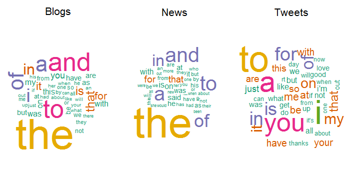

# Summary

I will build a web application that supports English language keyboard users by predicting the next word given what (if anything) the user has typed so far. There will be 2 modes, 'Tweet' mode, and 'Normal' mode. Each mode will run the same code but they will use different models for prediction. The models will learn from appropriate writing samples. The Tweet mode will be trained against a selection of actual tweets. The normal mode will be trained against a selection of news stories and blog posts.

# Data

That split into 2 modes is suggested by intuition and supported by my exploratory data analysis. I loaded the data with readLines (each line is its own source document) and explored it with the quanteda package. I used its default settings for break up each document into its words (a process called tokenization) and collected these interesting statistics from quanteda's corpus and dfm (Document Frequency Matrix) objects:

```{r, echo=FALSE}
load('BasicStats.rda')
BasicStats
```

Note that the tweets data has a much lower average word count than the others and its ratio of distinct words to all words is much higher compared to the others.

To visualize the average word count distinction, review these histograms:


The tweets use a different vocabulary, too, compared to the other sources as hinted by these word clouds. Note the tweet emphasis on "to", "you", and "i" instead of on "the" and "and":


# Additional Detail

I am not going to use a dictionary (external wordlist) to inform my model. Instead, I am going to treat common mispellings as if they were words. The implication is that my application will support both normal users and users whose style is less formal.

I want my model to avoid suggesting profane words. I have defined a small set of profane words. To build the list, I used a Google search and also my own experience. I consider a word to be profane if it is almost allways offensive to a significant portion of the population. I am going to ignore all documents that use those words. An alternative to preserve the ngram information in those documents would be to replace the profane words with synonyms that are not profane. I judge that not to be a priority.

The quanteda objects are large (double digit GB) enough that they can't be used directly to produce predictions in a timely fashion. Fortunately, the most common word combinations (called ngrams) account for much of the predictive value. I will dramatically prune low occurrance combinations from the training data.

Predictions will be driven by ngrams computed using quanteda. I'll compute the most common 1, 2, 3, and 4 word ngrams so that I can reasonably predict the 4th word given 3. Simple back off will be implemented. Initial word guidance will be frequency weighted random from the top few words for each mode's source data.

My final application should be thought of as an introduction to this problem area, not "the solution" that one would really want. There are a number of ways to improve it. The models can be improved by increasing the range of training data. It would be especially helpful to include selections from additional sources, for instance text message data to improve tweet mode or book text data to improve normal mode. The functionality can be made more valuable by adding more modes and more languages. The simple back off model (for when the basic model has no prediction) can be replaced with something more realistic. More can be precomputed to speed up processing. Partial word support could be added so that the suggestions change as each letter is typed by the user. 

The application will be written in R and built in Shiny. It will be hosted on RStudio's Shiny servers.

# Acknowledgements and Notes

Thanks to Hans Christensen of HC Corpora for the data (via Coursera: https://d396qusza40orc.cloudfront.net/dsscapstone/dataset/Coursera-SwiftKey.zip) used to train the models. For more information: http://www.corpora.heliohost.org/.

For purposes of this exploratory analysis, I have defined 'word' to be a token using the default settings of the quanteda package. For more info: https://cran.r-project.org/web/packages/quanteda/.

To test my models, I will use benchmarking script and data adapted from "jan-san" via GitHub: https://github.com/jan-san/dsci-benchmark/. Note that the original was developed for the 3rd edition of this capstone. Further note the benchmark data is very limited so the results, while valuable, are of limited accuracy.
