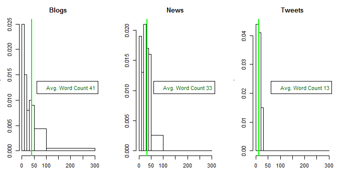

This is my capstone milestone report.

I will build a web application that supports text authors by predicting the next word given what (if anything) the user has typed so far. There will be 2 modes, 'Tweet' mode, and 'Normal' mode. Each mode will run the same code but they will use different models for prediction. The models will learn from appropriate sample writing. The Tweets mode will be trained against a selection of actual tweets. The normal mode will be trained against a selection of news stories and blog posts.

I am not going to use a dictionary (external wordlist) to inform my model. I am going to accept common mispellings as if they were words. The implication is that my application will support both normal users and users whose style is less formal.

I want my model to avoid suggesting profane words. I have defined a small set of profane words. To build the list, I used a Google search and also my own experience I included words that are almost allways offensive to a significant portion of the population. I am going to ignore all documents that use those words. An alternative to preserve the ngram information in those documents would be to replace the profane words with synonyms that are not profane. I judge that not to be a priority.

The final application can be thought of as an introduction to this problem area, not "the solution" that one would really want. There are a number of ways to improve it. The models can be improve by increasing the range of training data. The functionality can be made more valuable by adding more modes and more languages. The simple back off model (for when the basic model has no prediction) can be replaced with something more realistic. More can be precomputed to speed up processing. Partial word support could be added so that the suggestions change as each letter is typed by the user. 


```{r}
summary(cars)
```

You can also



embed plots, for example:

```{r, echo=FALSE}
plot(cars)
```

# Acknowledgements and Notes

Thanks to Hans Christensen of HC Corpora for the data used to train the models. For more information: http://www.corpora.heliohost.org/.

For purposes of this exploratory analysis, I have defined 'word' to be a token using the default settings of the quanteda package. For more info: https://cran.r-project.org/web/packages/quanteda/.

To test my models, I will use benchmarking script and data adapted from "jan-san" via GitHub: https://github.com/jan-san/dsci-benchmark/. Note that the original was developed for the 3rd edition of this capstone.
